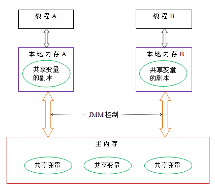
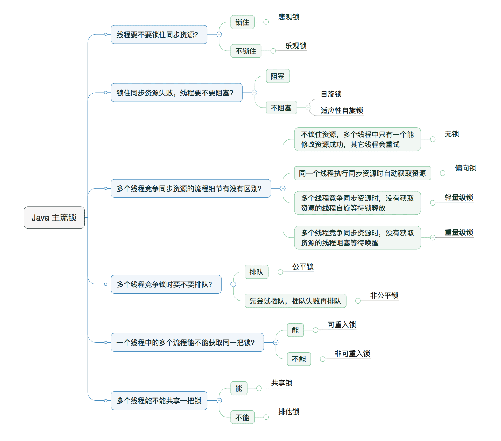

为什么需要多线程  
众所周知，CPU、内存、I/O 设备的速度是有极大差异的，为了合理利用 CPU 的高性能，平衡这三者的速度差异，计算机体系结构、操作系统、编译程序都做出了贡献，  
主要体现为:  
CPU 增加了缓存，以均衡与内存的速度差异；// 导致 可见性问题  
操作系统增加了进程、线程，以分时复用 CPU，进而均衡 CPU 与 I/O 设备的速度差异；// 导致 原子性问题  
编译程序优化指令执行次序，使得缓存能够得到更加合理地利用。// 导致 有序性问题  

java 内存模型  
用来解决多线程并发问题，JMM 属于语言级的内存模型，它确保在不同的编译器和不同的处理器平台之上，通过happens-before规则禁止特定类型的编译器重排序和处理器重排序，为程序员提供一致的内存可见性保证,**  **
线程之间的通信机制有两种：共享内存和消息传递  
Java 的并发采用的是共享内存模型，Java 线程之间的通信总是隐式进行，整个通信过程对程序员完全透明  
Java 线程之间的通信由 Java 内存模型（本文简称为 JMM）控制 JMM 决定一个线程对共享变量的写入何时对另一个线程可见。 从抽象的角度来看，JMM 定义了线程和主内存之间的抽象关系：线程之间的共享变量存储在主内存（main memory）中，每个线程都有一个私有的本地内存（local memory），本地内存中存储了该线程以读 / 写共享变量的副本。本地内存是 JMM 的一个抽象概念，并不真实存在。它涵盖了缓存，写缓冲区，寄存器以及其他的硬件和编译器优化。Java 内存模型的抽象示意图如下

首先要明白1是java是线程通信共享内存，所以都是通过对主内存写入共享变量来通信，2编译器和处理器会对指令重排序。两种情况都会导致顺序问题，导致程序结果不正确，所以java内存模型通过happens-before规则来禁止特定类型的编译器重排序和处理器重排序，保证程序结果正确性  

java的所有锁

https://pdai.tech/md/java/thread/java-thread-x-lock-all.html  
synchronized详解  
https://pdai.tech/md/java/thread/java-thread-x-key-synchronized.html
volatile详解  
https://pdai.tech/md/java/thread/java-thread-x-key-volatile.html
final详解  
https://pdai.tech/md/java/thread/java-thread-x-key-final.html